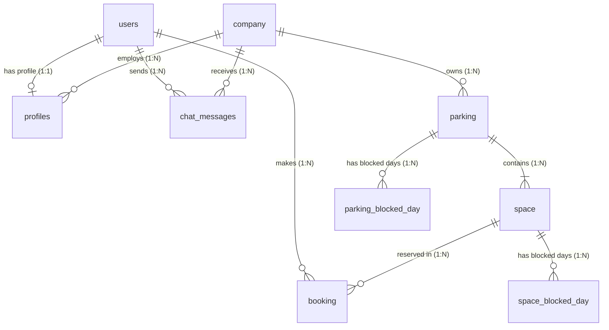

*This project has been created as part of the 42 curriculum by elarrea-, joscastr, luisanch, mikegonz.*

# Hemen-Go Camper Booking Platform

## Description

Hemen-Go is a full-stack web application for searching, reserving, managing, and validating camper parking spaces. The application includes a public search experience, authenticated user profiles, booking history, QR/plate access control, admin parking management, email notifications, and multilingual support.

Key features:
- Public parking search with filters by location, dates, electricity, waste disposal, and VIP spots.
- Authenticated booking flow with overlap validation for spaces and users.
- User profile management, password reset, email verification, and payment method configuration.
- Admin dashboard to create, update, and manage parkings and spaces.
- Booking history, cancellation, rating, QR code endpoint, and license plate access verification.
- English, Spanish, and Basque translations.
- Docker Compose environment for local development.

## Instructions

### Prerequisites

- Node.js 20+ and npm
- Python 3.12+
- Docker and Docker Compose
- PostgreSQL-compatible environment for production deployment
- A valid deployment domain and TLS certificates for HTTPS

### Local development

1. Clone the repository.
2. Create the environment file (choose one):
   - Interactive: run `make env` to generate `.env` with sensible defaults.
   - Manual: copy `.env.example` to `.env` and fill in real local values.
3. Start the stack with the provided Makefile (recommended):

```bash
make dev
```

   This runs `docker compose -f docker-compose.yml -f docker-compose.dev.yml up --build`, starting the database, the Flask backend (HTTPS on `BACK_PORT`, default 8000) and the Angular dev frontend (HTTP on `FRONT_PORT`, default 4200). Without Make, use: `docker compose -f docker-compose.yml -f docker-compose.dev.yml up --build`.
4. Open the frontend dev server at `http://localhost:4200` (HTTP). The `URL_FRONT`/`URL_BACK` values in `.env` (e.g. `https://localhost:4200`) are used by the backend for redirects, emails and Stripe callbacks, not for accessing the dev server.

### Environment variables

The application reads configuration from `.env`. Secrets must stay local and must never be committed. Generate it with `make env` or copy `.env.example` and edit it.

Important variables:
- `DATABASE_URL`: PostgreSQL connection string (internal Docker host `db:5432`).
- `JWT_SECRET_KEY`: secret used to sign JWT tokens.
- `MAIL_USERNAME`, `MAIL_PASSWORD`, `MAIL_DEFAULT_SENDER`: email service credentials.
- `PUBLIC_API_KEY`: API key for the documented public API.
- `PUBLIC_API_RATE_LIMIT`: requests per minute per IP for the public API.
- `STRIPE_KEY`: Stripe secret key required for the payment flow.
- `URL_FRONT`, `URL_BACK`: public URLs used by the backend for redirects, emails and Stripe callbacks.

Use `.env.example` as the template.

### Production deployment

For a production-like HTTPS setup with Nginx, use the provided Makefile target:

```bash
make prod
```

This runs `docker compose -f docker-compose.yml -f docker-compose.prod.yml up -d --build`, starting the database, the Flask backend (HTTPS on `BACK_PORT`) and the Nginx frontend serving the built Angular app over HTTPS on port 443 (self-signed certificate by default).

Before deploying to a real environment:
- Replace the self-signed certificates with valid TLS certificates.
- `FLASK_ENV=production` and `FLASK_DEBUG=0` are already set in `docker-compose.prod.yml`.
- Rotate `JWT_SECRET_KEY` and `PUBLIC_API_KEY`.
- Configure real SMTP and Stripe credentials.

## Resources

Relevant documentation:
- Angular documentation: https://angular.dev/
- Flask documentation: https://flask.palletsprojects.com/
- Flask-JWT-Extended documentation: https://flask-jwt-extended.readthedocs.io/
- Flask-SQLAlchemy documentation: https://flask-sqlalchemy.palletsprojects.com/
- Docker Compose documentation: https://docs.docker.com/compose/

### AI usage

AI tools were used to review requirements, identify compliance gaps, refactor repetitive code, generate documentation drafts, and suggest tests. All generated code and documentation were reviewed against the project architecture and the `transcendence_en.subject.pdf` requirements before being accepted.

## Team Information

| Member | Roles | Responsibilities |
| --- | --- | --- |
| joserra-dev | Product Owner, Technical Lead, Developer | Product scope, architecture decisions, backend routes, booking logic, subject compliance review |
| elarrea- | Developer | Backend/frontend contributions, reviews, and validation |
| joscastr | Developer | Backend/frontend contributions, reviews, and validation |
| luisanch | Developer | Backend/frontend contributions, reviews, and validation |
| luis | Developer, QA | Angular components, styling, booking UI, history/profile/admin flows, translations, frontend validation |
| mikegonz | Developer | Backend/frontend contributions, reviews, and validation |

If the team composition changed during the project, each member must update this table honestly before submission.

## Project Management

The team organized work through Git branches, pull requests, and local code reviews. Main coordination happened through Discord and shared notes. Features were split by area: authentication, user profile, parking search, booking management, admin panel, and DevOps.

Recommended practices followed:
- Feature branches for isolated work.
- Peer review for backend routes and frontend flows.
- Shared notes for decisions and known issues.
- Docker Compose as the default local environment.

## Technical Stack

- Frontend: Angular 20, TypeScript, Bootstrap, SCSS, `@ngx-translate/core`
- Backend: Flask, Flask-SQLAlchemy, Flask-JWT-Extended, Flask-Mailman, SQLAlchemy ORM
- Database: PostgreSQL
- DevOps: Docker, Docker Compose, Nginx for frontend static hosting
- Security: password hashing with Werkzeug, JWT authentication, backend validation, public API key and rate limiting
- AI/OCR: EasyOCR and OpenCV for license plate verification

## Database Schema

## Entity-Relationship Diagram (ERD)


Main tables:
- `users`: authentication identity, email, password hash, verification and password reset tokens.
- `profiles`: personal profile, role, company relation, DNI, birth date.
- `company`: organization owning parkings and administrators.
- `parking`: parking location, services, description, coordinates, TicketBAI series.
- `space`: parking spot, price, VIP/electricity flags, status.
- `booking`: user booking with space, dates, status, rating, license plate, total price, invoice/TicketBAI fields.

Main relationships:
- `users` 1:1 `profiles`
- `company` 1:N `profiles`
- `company` 1:N `parking`
- `parking` 1:N `space`
- `users` 1:N `booking`
- `space` 1:N `booking`

## Features List

| Feature | Team member(s) | Description |
| --- | --- | --- |
| Parking search | Backend/frontend team | Filters parkings by location, dates, and amenities with pagination and sorting. |
| Booking creation | Backend/frontend team | Creates reservations and prevents overlapping bookings. |
| User authentication | Backend/frontend team | Registration, login, email verification, password reset. |
| User profile | Backend/frontend team | Profile update, avatar upload via URL, password change, payment method configuration. |
| Friends system | Backend/frontend team | Add/remove/list friends with backend routes and profile UI. |
| Booking history | Backend/frontend team | List, filter, cancel, rate, and view booking details. |
| Admin panel | Backend/frontend team | Manage parkings, spaces, companies, users, bookings, and chat threads. |
| Access control | Backend team | OCR license plate verification against active bookings. |
| Public API | Backend team | API-key protected and rate-limited public endpoints with pagination. |
| Status endpoint | Backend team | `/api/status` health check for DevOps validation. |
| Organization system | Backend team | CRUD for companies, user-company assignment, and company metrics. |
| Multilingual UI | Frontend team | Spanish, English, and Basque translations. |

## Modules

| Module | Type | Points | Justification |
| --- | --- | --- | --- |
| Web: frontend and backend frameworks | Major | 2 | Angular frontend and Flask backend. |
| Web: ORM | Minor | 1 | Flask-SQLAlchemy models and relationships. |
| User Management: standard user management | Major | 2 | Registration, login, profile update, avatar upload, password reset, email verification, and friends system (add/remove/list). |
| User Management: advanced permissions | Major | 2 | User, admin, and super-admin roles with guarded routes and backend checks. |
| User Management: organization system | Major | 2 | Companies CRUD, user-company assignment, role management, and company metrics. |
| Accessibility and Internationalization: multiple languages | Minor | 1 | ES, EN, EU translations with language switching. |
| Web: advanced search | Minor | 1 | Search by location, dates, electricity, waste disposal, VIP spots, pagination, and sorting. |
| Modules of choice: booking/access system | Major | 2 | Custom reservation system with QR endpoint, booking history, cancellation, rating, and OCR access verification. |
| Modules of choice: public API | Minor | 1 | API-key protected and rate-limited public endpoints with pagination. |

Total: 14 points.

## Individual Contributions

### joserra-dev
- Backend architecture, Flask routes, models, booking validation, admin API, public API, status endpoint, access-control OCR route, Docker/backend configuration, and subject compliance review.

### elarrea-
- Backend/frontend contributions, reviews, and validation.

### joscastr
- Backend/frontend contributions, reviews, and validation.

### luisanch
- Backend/frontend contributions, reviews, and validation.

### luis
- Angular components, styling, booking UI, history/profile/admin flows, translations, frontend validation, friends system UI, and pagination/sorting UI.

### mikegonz
- Backend/frontend contributions, reviews, and validation.

## Known Limitations

- Local Docker Compose uses HTTPS with self-signed certificates for the backend API. The frontend dev server remains on HTTP; the browser may warn about the backend certificate.
- Production must be deployed behind HTTPS with valid certificates.
- The public API key is stored in `.env` and must be rotated before any real deployment.
- Email credentials are local development secrets and must not be committed.
- Some UI labels and tests still need final peer review before submission.

## Privacy Policy and Terms of Service

The application includes accessible links in the footer:
- `/legal/privacy`
- `/legal/terms`

Both pages are translated and contain project-specific content.
